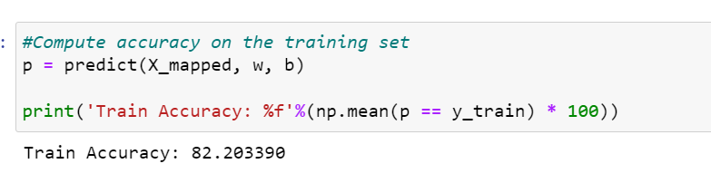

# Admission Prediction System (82% Accuracy)
This project implements a machine learning model to predict the probability of admission for university applicants based on their performance in two exams. Using logistic regression and classification techniques, the model provides insights into the likelihood of acceptance, enabling administrators to make data-driven decisions.

> **Note**: This project was developed as part of the Machine Learning course assignment by Andrew Ng, Stanford University.

## Features
Logistic Regression: Utilizes a binary classification algorithm to predict admission probabilities.

## Input Features:
> Exam 1 score
> Exam 2 score
> Historical Training Data: Leverages past applicant data to train the model and enhance accuracy.
> Performance: Achieves an accuracy rate of 82%, ensuring reliable predictions.
> User-Friendly Output: Displays admission probabilities for each applicant clearly and concisely.
## How It Works
> Data Preparation.
> Normalizes exam scores to improve model performance.
> Model Training.
## Prediction:
Takes new applicant exam scores as input.
Outputs the probability of admission for each applicant.
## High Accuracy: 
Reduces guesswork with a model accuracy of 82%.
## Prerequisites
Python (3.x)
Libraries: NumPy, pandas, matplotlib, scikit-learn

